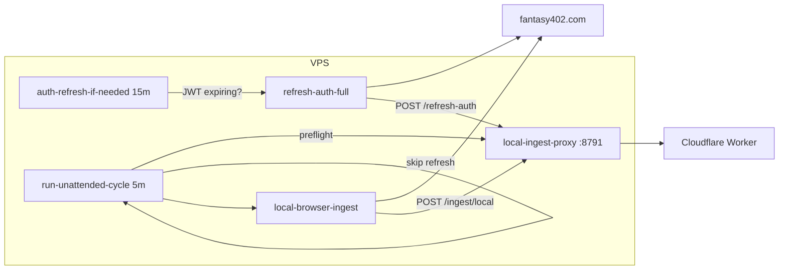

# Ingestion automation architecture

Fantasy402 ingestion auth spans **three planes** that must not fight each other.

## Three planes (why duplication fails)

| Plane | Where auth lives | Who ingests IP-bound routes | Typical host |
|-------|------------------|----------------------------|--------------|
| **VPS** | Puppeteer → `browser-auth.json` → Worker KV via proxy | `ingest:local-batch` / unattended cycle | Linux/macOS + systemd/launchd |
| **Dashboard (Pages)** | localStorage capture → `POST /refresh-auth` | Browser fetch from Pages (often **blocked by CORS**) | Cloudflare Pages |
| **Manager (live)** | `sessionStorage` + `renewToken` on fantasy402.com | Same-origin fetch from `manager.html` | Operator browser tab |

**Root constraint:** Cloudflare and Fantasy402 bind some cookies/JWT paths to **browser IP** and **origin**. The Worker cannot replace a VPS/browser for those routes. Worker `/trigger` from the edge will keep producing 403/skipped runs — that is expected, not a bug.

**Design goal:** one **source of truth** for upstream auth on the Worker (KV overlay), refreshed by exactly one **writer** per environment (VPS headless *or* dashboard capture *or* manager session), and ingest scheduled where fetch is allowed.

## Recommended production layout (VPS)



1. **`fantasy402-local-proxy.service`** — always on; holds `INGESTION_TRIGGER_TOKEN`.
2. **`fantasy402-auth-refresh.timer`** — runs `auth-refresh-if-needed.mjs` (not blind Puppeteer every tick).
3. **`fantasy402-ingest-batch.timer`** — runs `run-unattended-cycle.mjs --skip-refresh --auto-loops` (ingest only; auth is separate).

Set in `/etc/fantasy402/ingestion.env`:

```bash
WORKER_ORIGIN=http://127.0.0.1:8791
FANTASY402_WORKER_UPSTREAM=https://your-worker.workers.dev
F402_JWT_REFRESH_BUFFER_SEC=900   # refresh when <15m TTL (align with auth timer)
F402_JWT_INGEST_MIN_TTL_SEC=120   # do not start batch if JWT dies mid-flight
F402_AUTO_REFRESH_AUTH=1          # preflight may refresh on failure
```

## Policy module (`scripts/automation-policy.mjs`)

Centralizes:

- **When to refresh** — `shouldRefreshAuth()` (expired / expiring / proactive buffer / no local files / forced).
- **When to ingest** — `canRunIngestWithLocalAuth()` (JWT TTL must exceed ingest minimum).
- **How many loops** — `ingestLoopsFromCatalog()` from `pendingCount`.
- **Backoff** — `computeCycleBackoffMs()` after failed cycles (`fantasy402/.unattended-cycle-state.json`).

## Smart unattended cycle

`npm run ingest:unattended-cycle` (default):

1. Respect backoff unless `--force`.
2. Preflight (`GET /auth/health` via proxy).
3. Refresh **only if policy says so** (not every run).
4. Ingest with `--auto-loops` from catalog pending count.
5. Record outcome for next backoff window.

Flags:

| Flag | Effect |
|------|--------|
| `--skip-refresh` | Ingest timer mode (auth timer handles refresh) |
| `--auto-loops` | Derive batch count from `/ingest/catalog-status` |
| `--force` | Ignore backoff; force refresh decision |

## Dashboard behavior

`dashboard/js/automation-plane.js` classifies:

- **`worker-kv`** — Worker auth ready (KV overlay). Dashboard **does not** auto-ingest from Pages (CORS + wrong IP); shows VPS hint.
- **`manager-live`** — On `manager.html`; use live session + auto-runner.
- **`dashboard-browser`** — Capture/localStorage path.

Failed auto-ingest sets a **5-minute localStorage backoff** to avoid toast/spam loops.

## What not to automate (yet)

- Puppeteer from the dashboard (no headless browser on Pages).
- Worker `/trigger` as primary ingest (edge IP ≠ browser IP).
- Unconditional `auth:refresh-full` every 5 minutes (CF challenge risk + cost).

## Observability

| Signal | Where |
|--------|--------|
| Auth readiness | `GET /auth/health` (Worker + proxy aggregate) |
| Last unattended run | `fantasy402/.unattended-cycle-state.json` |
| Refresh history | `fantasy402/.auth-refresh-state.json` |
| Operator CLI | `npm run auth:stack-status` |
| Health monitor (exit 0/1) | `npm run auth:monitor` (`--json`, `--alert`) |
| Webhook on failure streak | `F402_ALERT_WEBHOOK_URL` + `F402_ALERT_FAILURE_THRESHOLD` (default 3) |

Point **healthchecks.io** or Uptime Kuma at `bun scripts/monitor-auth-stack.mjs` every 5–15 minutes. Use `--alert` on the monitor job if you want a second webhook path independent of the ingest timer.

## Further improvements (backlog)

- Push metrics (Prometheus) on cycle state failures.
- Align auth timer interval with `F402_JWT_REFRESH_BUFFER_SEC` dynamically.
- Worker cron for **non-IP-bound** routes only, VPS for the rest (split catalog by `zone`).
- Single webhook when `consecutiveFailures >= 3`.
